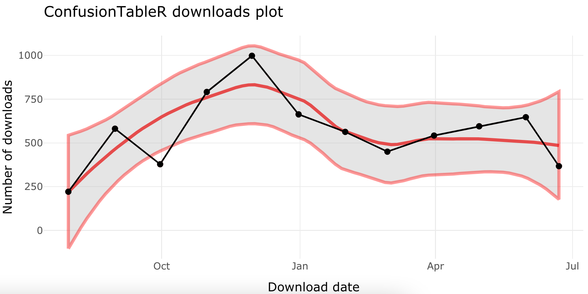

# Package Tracker

 <!-- badges: start -->
  [](https://www.repostatus.org/#active)
  
  <!-- badges: end -->

This is a function to track your packages and create download and output statistics as a list object. The outputs from the PackageTracker function are:

1. The download statistics per month 
2. The download plot
3. Aggregate summary of the number of downloads per month

To use the tracker just type in the name of your package on CRAN to download, such as `package_to_search <- 'ConfusionTableR'`.

## Using the function

```{r}
package_to_search <- 'ConfusionTableR'
results <- package_trackeR(c(package_to_search))
```
To output the results of the package use:

```{r}
results_vec <- results$download_df$downloads
mean(results_vec)
```

This will produce a summary of the downloads, per month, for that package. 

To generate a plot, you can use:

```{r}
plot <- results$downloads_plot
```

Printing this plot will give you a standard ggplot2 object, but to spice it up we can add a smoothing function, and some styling, plus wrap it in a plotly wrapper:

```{r}
library(plotly)
plot <- plot + geom_smooth(color='red', fill='grey', method='loess', formula='y ~ x') + geom_line(color='black') + 
  geom_point(color='black') + theme(legend.position = 'none') + 
  labs(title=paste(package_to_search, 'downloads plot'))
ggplotly(plot)
```

This will produce a similar plot to this:


